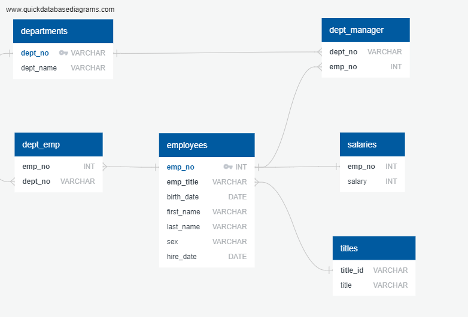

# Employee Database: A Mystery in Two Parts

## Overview of Project
I've been hired as a new data engineer at Pewlett Hackard. My first major task is a research project on employees of the corporation from the 1980s and 1990s. All that remain of the database of employees from that period are six CSV files. My action items are to design the tables to hold data in the CSVs, import the CSVs into a SQL database, and answer questions about the data. 

#### Data Modeling

#### Results
* See the Images folder for a snippit of query results.

