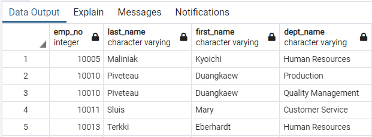

# **Pwelett Hackard Analysis**
  

  

## **Overview of Project**
I've been hired as a new data engineer at Pewlett Hackard. My first major task is a research project on employees of the corporation from the 1980s and 1990s. All that remain of the database of employees from that period are six CSV files. My action items are to design the tables to hold data in the CSVs, import the CSVs into a SQL database, and answer questions about the data. 
  

## **Data Modeling**
* The purpose of this diagram is to create a visual representation of the six CSV files based common attributes. 

## **Results**

### Employee Details: 
* There are currently 300,024 employees at Pewlett Hackard.

### Employees Hired in 1986:
* 36,150 employees were hired in 1986.

### Managers By Department
* See image below for breakdown of managers by department

### Employees By Department:
* See image below for breakdown of employees by department

### Employees Whose First Name Is “Hercules” and Last Names Begin With “B.”
* There are 20 employees whose first name is Hercules and last name begins with a B.

### All Sales Department Employees:
There are 52,245 employees in the Sales department.

### All Sales and Development Departments Employees
There are a total of 137,952 employees in the Sales and Development department.

### Frequency Count of Employee Last Names in Descending Order:
* Please run query on PostGres for a full list of employee last name counts.

## Summary
 * As mentioned above, there are 300,024 employees at Pewlett Hackard
 * Approximately 12% of the workforce was hired in 1986
 * There are nine departments at this company including: Marketing, Finance, Human Resources, Production, Development, Quality Management, Sales, Research, and Customer Service
 * Approximately 46% of the employees reside in the Sales and Development department
 
